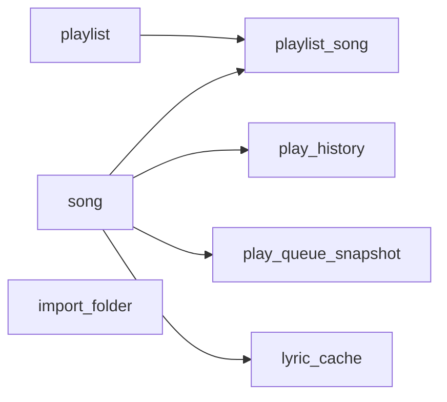

# LxuanMusic 数据库设计文档

## 1. 文档定位

本文档描述 `LxuanMusic` 的数据库设计方案，服务于以下目标：

- 为本地音乐播放器提供稳定的数据持久化能力
- 以 `SQLite` 作为唯一落地方案
- 统一歌曲、歌单、收藏、历史等核心数据模型

本文档属于**目标数据库方案文档**，与 `README.md` 的现状口径不同。

> **当前代码现状说明**：
> - 配置持久化（主题、音量、快捷键开关等）由 `ConfigDao` 通过 **INI 配置文件** 实现，为主配置存储方式。
> - `DbDao` 同时提供了 `app_setting` 表作为备选配置存储，当前版本中部分配置项（如导入文件夹记录）也通过数据库存储。
> - 歌词内容优先通过解析本地 `.lrc` 文件实时获取，同时 `lyric_cache` 表用于缓存解析后的歌词内容。
> - `playlist` 表已增加 `cover_path` 字段用于存储歌单封面路径，支持歌单封面持久化。
> - `song` 表已增加 `play_count` 字段用于记录播放次数。
> - `play_history` 表已增加 `played_duration_ms` 字段用于记录实际播放时长。
> - 新增 `play_queue_snapshot` 表用于持久化播放队列快照。
> - 新增 `import_folder` 表用于管理已导入的音乐文件夹。
> - 已落地**批量事务写入**接口 `insertSongsBatch()`，支持导入大量歌曲时单事务批量插入，显著提升写入性能。

---

## 2. 数据库设计目标

### 2.1 本版支撑的业务能力

本版数据库需要支撑以下功能：

1. 本地音频文件元数据持久化
2. 自定义歌单与系统歌单管理
3. 收藏状态维护（通过"我喜欢"系统歌单的关联表实现）
4. 播放历史记录
5. 歌词缓存（`lyric_cache` 表）
6. 播放队列快照（`play_queue_snapshot` 表）
7. 导入文件夹管理（`import_folder` 表）
8. 应用配置备选存储（`app_setting` 表）

### 2.2 存储策略

- 使用 `SQLite`
- 面向单机单用户桌面场景
- 无需额外部署数据库服务

### 2.3 设计原则

- **轻量实用**：不过度拆表，优先保证桌面端实现复杂度可控
- **支持扩展**：为后续在线功能、云同步留出空间
- **兼容 Qt 类型系统**：时间、布尔、整型字段便于与 `QSqlQuery` 对接

---

## 3. 核心实体与关系

本项目采用如下核心实体：

- 歌曲表 `song`
- 歌单表 `playlist`
- 歌单歌曲关联表 `playlist_song`
- 播放历史表 `play_history`
- 应用配置表 `app_setting`
- 播放队列快照表 `play_queue_snapshot`
- 导入文件夹表 `import_folder`
- 歌词缓存表 `lyric_cache`



### 3.1 关系说明

1. 一首歌可以属于多个歌单
2. 一个歌单可以包含多首歌
3. 一首歌可以对应多条播放历史
4. 一首歌可以对应一条歌词缓存
5. 设置表使用 INI 键值结构为主，数据库 `app_setting` 为备选

---

## 4. 数据表定义

### 4.1 歌曲表 `song`

| 字段 | 含义 | 说明 |
| --- | --- | --- |
| `song_id` | 歌曲主键 | 自增整数主键 |
| `file_path` | 文件绝对路径 | 全局唯一，用于去重 |
| `title` | 标题 | 元数据标题，允许为空字符串 |
| `artist` | 歌手 | 元数据歌手，默认「未知歌手」 |
| `album` | 专辑 | 元数据专辑，默认「未知专辑」 |
| `duration` | 时长 | 单位毫秒 |
| `file_size` | 文件大小 | 单位字节 |
| `bit_rate` | 比特率 | 单位 kbps |
| `add_time` | 导入时间 | 首次入库时间 |
| `is_favorite` | 是否收藏 | 0 或 1（收藏关系主要通过 `playlist_song` 关联表维护） |
| `lrc_path` | 本地歌词路径 | 可为空，默认空字符串 |
| `play_count` | 播放次数 | 记录歌曲累计播放次数，默认 0 |

#### 设计说明

- 使用 `file_path` 做唯一约束，避免重复导入
- `lrc_path` 允许为空，避免 SQL `NOT NULL` 约束导致插入失败
- `is_favorite` 字段保留，但收藏逻辑优先通过 `playlist_song` 关联表（"我喜欢"歌单）实现，支持按收藏时间排序
- `play_count` 用于统计歌曲热度，支持按播放次数排序

---

### 4.2 歌单表 `playlist`

| 字段 | 含义 | 说明 |
| --- | --- | --- |
| `playlist_id` | 歌单主键 | 自增或固定系统 ID |
| `name` | 歌单名称 | 用户可见 |
| `is_system` | 是否系统歌单 | 0=自定义，1=系统内置（不可删除） |
| `description` | 歌单简介 | 默认为空字符串 |
| `create_time` | 创建时间 | 建立时间 |
| `cover_path` | 歌单封面路径 | 默认为空字符串 |

#### 系统歌单约定

预置以下系统歌单（固定 ID，不可删除）：

| 固定 ID | 名称 | 用途 |
| --- | --- | --- |
| `0` | 本地音乐 | 所有导入歌曲默认归属 |
| `1` | 我喜欢的音乐 | 收藏歌曲映射 |
| `2` | 播放历史 | 供 UI 展示历史入口 |

自定义歌单 ID 从 `100` 开始自增。

---

### 4.3 歌单歌曲关联表 `playlist_song`

| 字段 | 含义 | 说明 |
| --- | --- | --- |
| `id` | 主键 | 自增主键 |
| `playlist_id` | 歌单 ID | 关联 `playlist.playlist_id` |
| `song_id` | 歌曲 ID | 关联 `song.song_id` |
| `add_time` | 加入时间 | 记录加入歌单时间，支持按时间排序 |

#### 约束说明

- `playlist_id + song_id` 必须唯一
- 避免同一首歌被重复加入同一个歌单
- 外键约束：删除歌曲或歌单时级联清理关联记录

---

### 4.4 播放历史表 `play_history`

| 字段 | 含义 | 说明 |
| --- | --- | --- |
| `id` | 主键 | 自增主键 |
| `song_id` | 歌曲 ID | 对应 `song.song_id` |
| `play_time` | 播放时间 | 实际开始播放时间 |
| `played_duration_ms` | 实际播放时长 | 单位毫秒，默认 0 |

#### 设计说明

- 用于实现最近播放列表
- 每次播放新增一条记录，查询时按歌曲去重并按最后播放时间排序
- 后台自动清理：仅保留最近 1000 条记录，避免无限增长
- `played_duration_ms` 用于统计实际收听时长

---

### 4.5 应用配置表 `app_setting`

| 字段 | 含义 | 说明 |
| --- | --- | --- |
| `setting_key` | 配置键 | 主键，唯一标识配置项 |
| `setting_value` | 配置值 | 配置项的值 |
| `update_time` | 更新时间 | 最后修改时间 |

#### 设计说明

- 作为 `ConfigDao`（INI 文件）的备选配置存储方案
- 适合需要跨设备同步或事务一致性要求较高的配置项
- 当前版本中，主要配置仍由 `ConfigDao` 通过 INI 文件管理

---

### 4.6 播放队列快照表 `play_queue_snapshot`

| 字段 | 含义 | 说明 |
| --- | --- | --- |
| `id` | 主键 | 自增主键 |
| `song_id` | 歌曲 ID | 对应 `song.song_id` |
| `order_index` | 顺序索引 | 歌曲在队列中的位置 |
| `is_current` | 是否为当前播放 | 0=否，1=是 |
| `create_time` | 创建时间 | 快照生成时间 |

#### 设计说明

- 用于程序退出时保存当前播放队列，下次启动恢复
- 每次保存前应先清空旧快照

---

### 4.7 导入文件夹表 `import_folder`

| 字段 | 含义 | 说明 |
| --- | --- | --- |
| `folder_id` | 主键 | 自增主键 |
| `folder_path` | 文件夹路径 | 绝对路径，唯一约束 |
| `auto_scan` | 是否自动扫描 | 0=否，1=是 |
| `last_scan_time` | 上次扫描时间 | 可为空 |
| `add_time` | 添加时间 | 首次添加时间 |

#### 设计说明

- 记录用户已导入的音乐文件夹
- 支持后续增量扫描与自动监控功能扩展

---

### 4.8 歌词缓存表 `lyric_cache`

| 字段 | 含义 | 说明 |
| --- | --- | --- |
| `song_id` | 歌曲 ID | 主键，对应 `song.song_id` |
| `lrc_content` | 歌词内容 | 缓存的 LRC 文本 |
| `source_type` | 来源类型 | 0=本地文件，1=在线下载 |
| `update_time` | 更新时间 | 缓存更新时间 |

#### 设计说明

- 缓存解析后的歌词内容，避免重复读取本地文件
- 支持后续扩展在线歌词下载缓存

---

## 5. SQLite 建表 SQL

```sql
PRAGMA foreign_keys = ON;
PRAGMA journal_mode = WAL;

CREATE TABLE IF NOT EXISTS song (
    song_id INTEGER PRIMARY KEY AUTOINCREMENT,
    file_path TEXT NOT NULL UNIQUE,
    title TEXT NOT NULL DEFAULT '',
    artist TEXT NOT NULL DEFAULT '未知歌手',
    album TEXT NOT NULL DEFAULT '未知专辑',
    duration INTEGER NOT NULL DEFAULT 0,
    file_size INTEGER NOT NULL DEFAULT 0,
    bit_rate INTEGER NOT NULL DEFAULT 0,
    add_time TEXT NOT NULL DEFAULT CURRENT_TIMESTAMP,
    is_favorite INTEGER NOT NULL DEFAULT 0,
    lrc_path TEXT DEFAULT '',
    play_count INTEGER NOT NULL DEFAULT 0
);

CREATE INDEX IF NOT EXISTS idx_song_title_artist ON song(title, artist);
CREATE INDEX IF NOT EXISTS idx_song_play_count ON song(play_count DESC);

CREATE TABLE IF NOT EXISTS playlist (
    playlist_id INTEGER NOT NULL PRIMARY KEY,
    name TEXT NOT NULL,
    is_system INTEGER NOT NULL DEFAULT 0,
    description TEXT DEFAULT '',
    create_time TEXT NOT NULL DEFAULT CURRENT_TIMESTAMP,
    cover_path TEXT DEFAULT ''
);

CREATE TABLE IF NOT EXISTS playlist_song (
    id INTEGER PRIMARY KEY AUTOINCREMENT,
    playlist_id INTEGER NOT NULL,
    song_id INTEGER NOT NULL,
    add_time TEXT NOT NULL DEFAULT CURRENT_TIMESTAMP,
    UNIQUE(playlist_id, song_id),
    FOREIGN KEY(playlist_id) REFERENCES playlist(playlist_id) ON DELETE CASCADE,
    FOREIGN KEY(song_id) REFERENCES song(song_id) ON DELETE CASCADE
);

CREATE INDEX IF NOT EXISTS idx_playlist_song_playlist_id ON playlist_song(playlist_id);
CREATE INDEX IF NOT EXISTS idx_playlist_song_song_id ON playlist_song(song_id);

CREATE TABLE IF NOT EXISTS play_history (
    id INTEGER PRIMARY KEY AUTOINCREMENT,
    song_id INTEGER NOT NULL,
    play_time TEXT NOT NULL DEFAULT CURRENT_TIMESTAMP,
    played_duration_ms INTEGER NOT NULL DEFAULT 0,
    FOREIGN KEY(song_id) REFERENCES song(song_id) ON DELETE CASCADE
);

CREATE INDEX IF NOT EXISTS idx_play_history_time ON play_history(play_time DESC);

CREATE TABLE IF NOT EXISTS app_setting (
    setting_key TEXT PRIMARY KEY,
    setting_value TEXT NOT NULL DEFAULT '',
    update_time TEXT NOT NULL DEFAULT CURRENT_TIMESTAMP
);

CREATE TABLE IF NOT EXISTS play_queue_snapshot (
    id INTEGER PRIMARY KEY AUTOINCREMENT,
    song_id INTEGER NOT NULL,
    order_index INTEGER NOT NULL,
    is_current INTEGER NOT NULL DEFAULT 0,
    create_time TEXT NOT NULL DEFAULT CURRENT_TIMESTAMP,
    FOREIGN KEY(song_id) REFERENCES song(song_id) ON DELETE CASCADE
);

CREATE INDEX IF NOT EXISTS idx_queue_snapshot_order ON play_queue_snapshot(order_index);

CREATE TABLE IF NOT EXISTS import_folder (
    folder_id INTEGER PRIMARY KEY AUTOINCREMENT,
    folder_path TEXT NOT NULL UNIQUE,
    auto_scan INTEGER NOT NULL DEFAULT 0,
    last_scan_time TEXT DEFAULT '',
    add_time TEXT NOT NULL DEFAULT CURRENT_TIMESTAMP
);

CREATE TABLE IF NOT EXISTS lyric_cache (
    song_id INTEGER PRIMARY KEY,
    lrc_content TEXT NOT NULL DEFAULT '',
    source_type INTEGER NOT NULL DEFAULT 0,
    update_time TEXT NOT NULL DEFAULT CURRENT_TIMESTAMP,
    FOREIGN KEY(song_id) REFERENCES song(song_id) ON DELETE CASCADE
);

-- 初始化系统歌单
INSERT OR IGNORE INTO playlist (playlist_id, name, is_system, description) VALUES
    (0, '本地音乐', 1, ''),
    (1, '我喜欢的音乐', 1, ''),
    (2, '播放历史', 1, '');
```

---

## 6. DAO 设计建议

### 6.1 统一接口

对上层暴露统一接口，例如：

- `initDb`
- `createTables`
- `insertSong`
- `updateSong`
- `queryAllSongs`
- `insertPlaylist`
- `queryPlaylistSongs`
- `addPlayHistory`
- `saveSetting` / `querySetting`
- `savePlayQueueSnapshot` / `loadPlayQueueSnapshot`
- `addImportFolder` / `queryAllImportFolders`
- `saveLyricCache` / `queryLyricCache`

### 6.2 批量写入接口（已落地）

```cpp
bool insertSongsBatch(const QList<Song> &songs, int playlistId);
```

- 使用**单事务**包裹全部写入操作
- 复用 `QSqlQuery` 的 `prepare`/`bindValue`，避免逐条 `commit` 带来的磁盘 I/O 开销
- 支持已存在记录的批量更新与新记录的批量插入
- 导入大量歌曲时，性能显著优于逐条单事务写入

### 6.3 建议增加的配置项

- `db.sqlite.path`：指定 SQLite 数据库文件路径

---

## 7. 索引与性能建议

### 7.1 推荐索引

1. `song.file_path`
   - 去重核心字段

2. `song.title + song.artist`
   - 支持本地搜索

3. `song.play_count`
   - 支持按播放次数排序

4. `playlist_song.playlist_id`
   - 加快歌单内歌曲查询

5. `play_history.play_time`
   - 加快最近播放查询

6. `play_queue_snapshot.order_index`
   - 加快队列恢复排序

### 7.2 桌面端场景优化建议

1. 导入大量文件时采用**批量事务写入**（当前已落地 `insertSongsBatch`）
2. 利用 `file_path` 与文件修改时间做增量扫描（后续可扩展 `file_mtime` 字段）
3. 歌词内容通过本地文件缓存，避免重复解析
4. 播放历史定期裁剪，避免无限增长（当前已自动保留最近 1000 条）
5. 播放队列快照在程序退出时保存，启动时恢复

---

## 8. 数据库初始化建议

推荐程序启动时执行以下顺序：


### 8.1 默认初始化内容

#### 系统歌单

- 本地音乐（ID=0）
- 我喜欢的音乐（ID=1）
- 播放历史（ID=2）

#### 默认设置

- 主题、音量、循环模式、桌面歌词开关、全局快捷键开关等由 `ConfigDao` 通过 INI 文件管理，为主配置方案。
- `app_setting` 表作为备选配置存储，当前版本暂未完全替代 INI 配置。

---

## 9. 与当前代码现状的关系

当前仓库中的数据库代码已实现以下能力：

- **SQLite 默认连接**：程序启动时自动初始化 SQLite，路径为系统 `AppData` 目录下的 `music_player.db`
- **自动建表与迁移**：`createTables()` 首次运行自动建表；`migrateSchema()` 支持旧表结构升级（如为 `playlist` 表增加 `description` / `cover_path` 字段、为 `song` 表去掉 `lrc_path` 的 `NOT NULL` 约束、增加 `play_count` 字段、为 `play_history` 表增加 `played_duration_ms` 字段）
- **完整 CRUD**：歌曲、歌单、关联、历史、配置、队列快照、导入文件夹、歌词缓存的增删改查均已实现
- **批量事务写入**：`insertSongsBatch()` 已落地，支持导入大量歌曲时单事务批量写入
- **系统歌单自动初始化**：`ensureSystemPlaylists()` 自动写入三条系统歌单

当前数据库整改的核心方向为：

1. 保持 SQLite 稳定可运行
2. 继续完善 DAO 查询性能与对象映射
3. 让歌曲、歌单、历史、队列快照、歌词缓存形成完整闭环

---

## 10. 后续扩展预留

虽然当前版本不交付在线能力，但数据库已预留扩展空间，后续可新增：

- 在线歌词缓存表扩展（`lyric_cache` 已预留 `source_type` 字段）
- 下载任务表
- 用户表
- 云同步映射表
- 第三方平台歌曲来源表

这些内容建议在当前版本稳定后再逐步加入，而不是提前混入本版核心数据模型。

---

## 11. 总结

本数据库方案遵循**SQLite 唯一落地、轻量实用、按需扩展**的原则，能够满足 `LxuanMusic` 当前本地播放器版本的主要持久化需求，也为后续联网和多端扩展保留了结构空间。

对于本版项目来说，最重要的落地顺序不是先追求复杂表结构，而是：

1. 先让 SQLite 单机版稳定可运行
2. 再补齐 DAO 层的完整读写链路
3. 最后在统一模型下按需扩展新表
