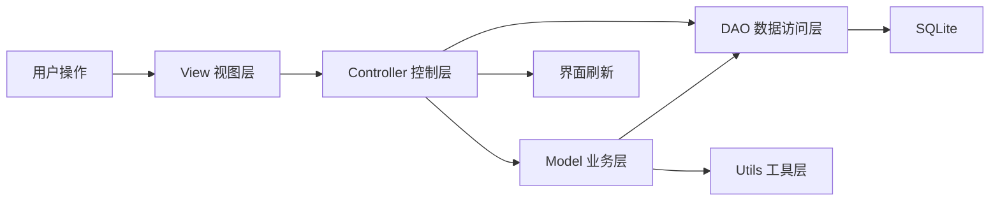
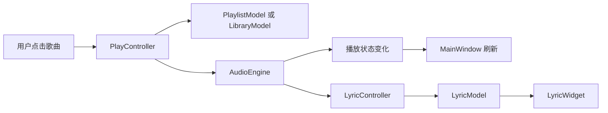
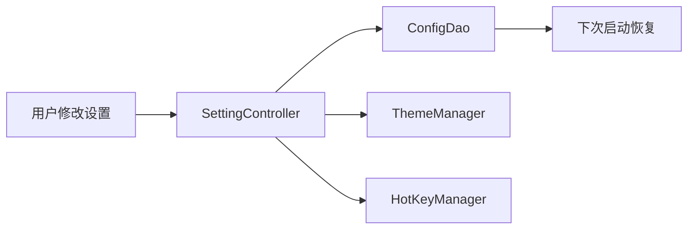

# LxuanMusic 架构设计文档

## 1. 文档定位

本文档用于说明 `LxuanMusic` 的**目标架构设计**、模块边界、关键数据流与重构路线。

与 `README.md` 的区别如下：

- `README.md` 以**当前代码真实现状**为主
- 本文档以**目标方案与最终规划**为主

因此，本文档中出现的部分能力可能尚未在代码中完全落地，但它们属于本版项目的正式目标。

---

## 2. 项目定位与版本边界

### 2.1 项目定位

本项目定位为基于 `Qt 6.8.x` 的桌面端本地音乐播放器，面向毕设展示场景，强调：

- 本地音乐管理
- 稳定的播放控制体验
- 清晰的分层架构
- 可演示的亮点功能
- 便于答辩阐述的工程化设计

### 2.2 本版交付范围

#### 核心能力

- 本地音频导入与扫描
- 音乐库管理（支持默认/歌手/专辑/文件夹分类视图）
- 播放队列管理
- 播放控制与循环模式
- 歌单、收藏、播放历史
- 本地歌词解析与同步展示
- 设置持久化（INI + 数据库双轨）
- SQLite 的本地持久化
- 播放队列快照与恢复
- 导入文件夹管理
- 歌词缓存

#### 毕设亮点

- 频谱可视化（ffmpeg + kiss_fft）
- 桌面歌词
- 全局快捷键（Windows 原生 API）

### 2.3 不纳入本版交付的内容

以下内容仅保留扩展接口或文档展望，不纳入当前版本验收：

- 在线搜索
- 在线歌词
- 下载管理
- 登录
- 社区功能

---

## 3. 总体架构

本项目采用**分层架构 + Qt 信号槽驱动**的组织方式。



### 3.1 分层目标

1. **View 层只负责界面与交互反馈**
2. **Controller 层负责调度，不承载底层实现细节**
3. **Model 层负责核心业务规则**
4. **DAO 层负责持久化抽象**
5. **Utils 层负责通用工具能力**

### 3.2 架构设计原则

- **单一职责**：每层只处理本层应承担的任务
- **弱耦合**：界面层不直接依赖底层播放器或数据库实现
- **演进友好**：当前可先跑通本地版，后续再扩展联网模块
- **可答辩**：每个模块边界清晰，便于解释设计理由

---

## 4. 目录与模块映射

```text
LxuanMusic/
├── views/          视图层
├── controllers/    控制层
├── models/         业务模型层
├── dao/            数据访问层
├── utils/          工具层
├── entity/         实体对象层
├── styles/         QSS 样式文件
├── README.md
├── 架构设计文档.md
└── database_schema.md
```

### 4.1 各目录职责

| 目录 | 职责 |
| --- | --- |
| `views` | 主窗口、自定义控件、歌词界面、侧边栏、弹出层、歌单详情、本地音乐列表 |
| `controllers` | 接收 UI 事件，调度业务逻辑，向界面回传状态 |
| `models` | 播放、歌词、音乐库、歌单、频谱等核心业务逻辑 |
| `dao` | 数据持久化接口、配置存储、缓存访问 |
| `utils` | 文件扫描、元数据提取、LRC 解析、主题、快捷键 |
| `entity` | `Song`、`Playlist` 等纯数据对象 |
| `styles` | QSS 主题样式文件（当前为静态资源，动态加载尚未完全打通） |

---

## 5. 分层设计说明

### 5.1 View 层

#### 目标职责

- 界面初始化
- 用户输入采集
- 当前状态展示
- 控件间视觉协调
- 不直接处理数据库与底层播放逻辑

#### 当前主要组件

| 组件 | 目标职责 |
| --- | --- |
| `MainWindow` | 主界面容器、页面组织、信号中转、状态刷新、频谱绘制 |
| `SideBarWidget` | 左侧导航、歌单分组入口、自定义歌单管理 |
| `LocalMusicWidget` | 本地音乐列表展示、导入触发、播放触发，支持默认/歌手/专辑/文件夹分类视图 |
| `PlaylistDetailWidget` | 歌单详情页，展示歌单内歌曲列表与批量播放 |
| `LyricWidget` | 主歌词与桌面歌词展示（悬浮窗、高亮、滚动、透明度/字号调节） |
| `PlaylistItem` / `PlaylistSongItem` | 歌单项与歌曲项渲染 |
| `VolumePopup` | 音量控制弹层 |
| `PlaylistPopup` | 当前播放队列弹窗，支持双击播放、收藏、移除、清空 |
| `AddToPlaylistPopup` | 收藏到歌单选择弹窗，支持创建新歌单并自动加入 |
| `CollapsibleGroup` | 折叠分组 UI 组件（侧边栏歌单分组使用） |

#### View 层约束

- 不直接创建和管理数据库连接
- 不直接写 SQL
- 不直接决定播放列表业务规则
- 不直接执行文件扫描与元数据提取

> **现状说明**：当前 `MainWindow` 中仍存在部分直接数据库访问（收藏逻辑、歌单列表刷新等），后续需逐步收敛到 Controller 层。

---

### 5.2 Controller 层

Controller 层是本项目的**事件调度中心**。

#### 目标职责

- 接收 View 层用户操作
- 组合调用 Model、DAO、Utils
- 回传结果与状态到 View
- 隔离界面逻辑与业务逻辑

#### 控制器划分

| 控制器 | 目标职责 | 当前状态 |
| --- | --- | --- |
| `PlayController` | 播放、暂停、切歌、循环模式、队列切换 | **已落地** |
| `LibraryController` | 导入文件、导入文件夹、扫描音乐库、搜索筛选、歌单/收藏/历史管理 | **已落地** |
| `LyricController` | 本地歌词匹配、解析、同步滚动、桌面歌词控制 | **已落地** |
| `SettingController` | 主题、音量、播放偏好、快捷键、桌面歌词配置 | **空壳，待补齐** |

#### Controller 层设计重点

1. 使用 Qt 信号槽完成状态广播
2. 对上提供清晰的事件接口
3. 对下只依赖明确的服务对象与数据对象
4. 把复杂业务流程拆分成可维护的调度步骤

---

### 5.3 Model 层

Model 层是系统的核心业务实现层。

#### 主要模型

| 模型 | 目标职责 | 当前状态 |
| --- | --- | --- |
| `AudioEngine` | 封装 `QMediaPlayer`、`QAudioOutput`，负责播放引擎 | **已落地** |
| `LibraryModel` | 管理本地音乐集合、去重、关键字筛选 | **已落地** |
| `PlaylistModel` | 管理歌单集合、歌单内歌曲顺序与状态 | **空壳，待补齐** |
| `LyricModel` | 管理歌词行、时间戳匹配、当前高亮索引 | **已落地** |
| `VisualizerModel` | 管理频谱采样数据、FFT 输出、UI 刷新输入 | **已落地** |

#### 关键设计说明

##### `AudioEngine`

目标是作为唯一的底层播放器封装层，统一处理：

- 当前媒体源
- 播放队列
- 播放状态
- 进度变更
- 倍速与音量
- 循环模式与自动切歌

这样可以避免在 `MainWindow` 中直接操作 `QMediaPlayer`。

##### `LibraryModel`

目标不是单纯存放 `Song` 列表，而是形成完整音乐库能力：

- 已导入歌曲集合
- 去重策略
- 按歌手与专辑分类（当前为筛选能力预留）
- 模糊搜索
- 最近导入排序

##### `VisualizerModel`

该模块是本版重点亮点之一，目标能力包括：

- 通过 `ffmpeg` 将音频解码为 PCM 数据
- 使用 `kiss_fft` 进行频域分析
- 输出适合 UI 绘制的频谱数据结构
- 支持 PCM 缓存、切歌淡入淡出、平滑与降噪处理

---

### 5.4 DAO 层

DAO 层负责把业务模型与底层数据库解耦。

#### DAO 层目标

- 提供统一的增删改查接口
- 封装事务
- 对上输出稳定的数据访问能力

#### DAO 组成

| 组件 | 目标职责 | 当前状态 |
| --- | --- | --- |
| `DbDao` | 核心业务数据持久化，包含歌曲、歌单、历史、收藏、队列快照、导入文件夹、歌词缓存等 | **已落地（SQLite）** |
| `ConfigDao` | 轻量配置持久化，如主题、音量、窗口状态、开关项 | **已落地（INI 文件）** |
| `CacheDao` | 内存缓存、短期状态缓存或中间数据缓存 | **基础实现已落地** |

#### 存储策略

- 本版唯一落地方案为 `SQLite`
- 无需额外部署数据库服务
- 适合单机单用户毕设演示
- 部署简单，演示风险低
- `ConfigDao` 使用 INI 文件为主配置方案，数据库 `app_setting` 表作为备选

---

### 5.5 Utils 层

Utils 层用于承载与业务相关但不适合放在 Controller 或 Model 中的通用能力。

| 工具类 | 目标职责 | 当前状态 |
| --- | --- | --- |
| `FileScanner` | 扫描目录、识别音频文件、输出文件列表 | **已落地** |
| `MetaDataExtractor` | 提取标题、歌手、专辑、时长、封面、歌词路径等元数据 | **已落地** |
| `LrcParser` | 解析 LRC 文件为时间轴结构 | **已落地** |
| `ThemeManager` | 统一主题切换与样式应用 | **空壳，待补齐** |
| `HotKeyManager` | 注册和注销系统级快捷键 | **已落地（Windows）** |

---

### 5.6 Entity 层

Entity 层只承载数据，不承载复杂业务。

#### 主要实体

| 实体 | 说明 |
| --- | --- |
| `Song` | 歌曲基础信息、文件路径、元数据、歌词路径、收藏状态、播放次数 |
| `Playlist` | 歌单基础信息、系统歌单标识、简介、封面路径、歌曲集合 |

#### 设计原则

- 保持轻量
- 可序列化或便于数据库映射
- 可通过 `QVariant` 与信号槽传递

---

## 6. 关键数据流设计

### 6.1 本地导入流程


#### 说明

1. View 只负责触发导入操作
2. `LibraryController` 负责调度扫描与入库
3. `FileScanner` 负责发现音频文件
4. `MetaDataExtractor` 负责提取歌曲信息
5. `DbDao` 负责持久化去重与保存
6. 最终由 View 刷新列表

---

### 6.2 播放流程



#### 说明

- `AudioEngine` 只负责播放内核
- 曲目信息与歌单关系由上层模型与控制器维护
- 歌词同步链路通过播放进度驱动

---

### 6.3 歌词同步流程


---

### 6.4 设置与快捷键流程



> **现状说明**：`SettingController` 与 `ThemeManager` 当前为空壳，设置变更由 `MainWindow` 直接调度 `ConfigDao` 与 `HotKeyManager`。

---

## 7. 数据存储架构

数据存储采用**统一逻辑模型 + SQLite 落地实现**。

### 7.1 统一逻辑模型

本项目的核心数据对象包括：

- 歌曲表
- 歌单表
- 歌单歌曲关联表
- 播放历史表
- 应用配置表
- 播放队列快照表
- 导入文件夹表
- 歌词缓存表

### 7.2 存储抽象原则

1. 业务层不直接感知具体数据库实现细节
2. 字段命名统一，便于 DAO 封装
3. 优先保障 SQLite 单机版稳定运行

详细表结构见 `database_schema.md`。

---

## 8. 当前现状与目标架构差距

本节用于解释为什么需要继续重构。

### 8.1 当前存在的问题

1. **部分模型与控制器仍为空壳**
   - `PlaylistModel`、`SettingController` 尚未承载业务
   - `ThemeManager` 尚未实现

2. **主窗口仍承担了部分业务职责**
   - 当前主窗口中仍存在收藏逻辑的直接数据库访问、歌单列表刷新等逻辑
   - 尚未完全收敛到 Controller 层

3. **主题切换尚未打通**
   - `ThemeManager` 为空壳，QSS 主题加载与切换尚未实现
   - `styles/style.qss` 已存在但未通过 `ThemeManager` 动态加载

4. **已修复的 UI 问题**
   - ✅ `PlaylistDetailWidget` 歌单封面比例与圆角问题已修复
   - ✅ `PlaylistSongItem` 歌曲封面提取与展示问题已修复
   - ✅ `PlaylistItem` 侧边栏歌单项已增加封面展示
   - ✅ `btnAvatar` 头像圆角矩形裁剪已修复
   - ✅ `btnSong` 默认封面铺满问题已修复
   - ✅ 托盘图标右键菜单位置与方向已修复

5. **已实现的模块（此前为空壳）**
   - ✅ `PlaylistPopup` 播放队列弹窗已实现
   - ✅ `AddToPlaylistPopup` 收藏到歌单弹窗已实现
   - ✅ `CollapsibleGroup` 折叠分组组件已实现
   - ✅ 播放历史 UI 已接入（`pageHistory` + `PlaylistDetailWidget`）
   - ✅ `LocalMusicWidget` 分类视图（歌手/专辑/文件夹）已实现
   - ✅ 播放队列快照（`play_queue_snapshot` 表 + DAO 接口）已落地
   - ✅ 导入文件夹管理（`import_folder` 表 + DAO 接口）已落地
   - ✅ 歌词缓存（`lyric_cache` 表 + DAO 接口）已落地
   - ✅ 托盘图标与桌面歌词联动已完善
   - ✅ `CacheDao` 基础缓存能力已落地（内存缓存歌曲/歌单/收藏/历史）
   - ✅ 异步批量导入（`QtConcurrent` 并行提取 + 批量事务写入）已落地

### 8.2 目标状态

目标状态应达到：

- 主窗口只保留 UI 管理职责
- Controller 层统一调度核心流程
- SQLite 成为唯一可运行存储方案
- 频谱、桌面歌词、全局快捷键成为可演示亮点
- 所有空壳模块补齐为可运行代码

---

## 9. 重构路线

### 第一阶段：补齐空壳模块

1. 实现 `PlaylistModel` 的歌单内歌曲顺序管理与状态缓存
2. 实现 `SettingController` 的设置变更统一调度
3. 实现 `ThemeManager` 的 QSS 主题加载与切换

### 第二阶段：分层收敛

1. 把主窗口中的收藏逻辑、历史刷新迁移到 Controller
2. 让 `LibraryController` 接管导入与筛选
3. 让 `PlayController` 接管播放队列切换
4. 让 `LyricController` 接管歌词匹配与同步

### 第三阶段：UI 闭环与体验优化

1. 桌面歌词窗口位置持久化
2. 主题切换完整配置项联动
3. 播放队列快照的启动恢复

### 第四阶段：文档与答辩收束

1. 同步 README 真实状态
2. 同步数据库文档
3. 同步架构设计文档与功能完成状态
4. 形成架构、存储、亮点、优化点的统一答辩口径

---

## 10. 答辩可讲的架构亮点

在毕设答辩中，可以重点阐述以下设计亮点：

1. **分层架构清晰**
   - UI、调度、业务、存储、工具职责明确

2. **播放器内核封装独立**
   - 底层播放统一由 `AudioEngine` 封装，避免 UI 与 Qt 多媒体组件强耦合

3. **DAO 持久化抽象**
   - `DbDao` 将业务模型与底层 SQLite 解耦，便于后续扩展其他存储方式
   - 支持自动建表、字段迁移、多表关联、队列快照、歌词缓存等完整能力

4. **亮点功能具备工程扩展价值**
   - 桌面歌词体现自定义 UI 与动画能力
   - 频谱可视化体现多媒体数据处理能力（ffmpeg + FFT）
   - 全局快捷键体现系统交互扩展能力（Windows 原生 API）

5. **异步批量导入优化**
   - `QtConcurrent` 多线程并行元数据提取，充分利用多核 CPU
   - 数据库批量事务写入，减少磁盘 I/O 开销
   - 导入过程不阻塞 UI，提升用户体验

6. **文档口径分离**
   - README 写真实现状
   - 设计文档写目标方案
   - 既避免夸大现状，也能完整展示设计能力

---

## 11. 后续扩展方向

以下内容不属于本版交付，但架构上已预留扩展空间：

- 在线搜索与试听
- 在线歌词自动匹配
- 下载管理
- 多用户与登录体系
- 云端歌单同步

这些能力可在 Controller 层新增网络调度器、在 DAO 层新增网络缓存表或同步表，而不需要推翻现有分层结构。

---

## 12. 总结

`LxuanMusic` 的目标不是单纯做一个能播放音频的界面程序，而是形成一个结构清晰、能够支撑毕设答辩的 Qt 桌面播放器工程。

本架构方案的核心价值在于：

- 让当前原型代码逐步收敛为可维护工程
- 让 SQLite 本地方案稳定落地
- 让频谱、桌面歌词、全局快捷键成为真正可讲、可演示的亮点
